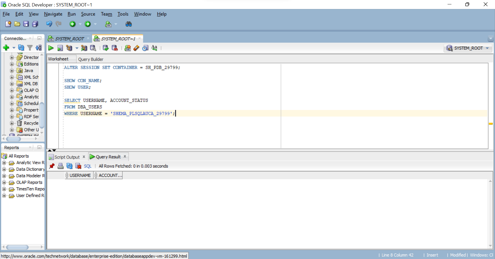
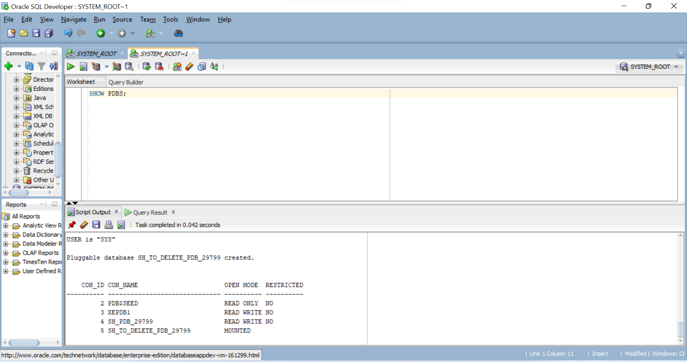
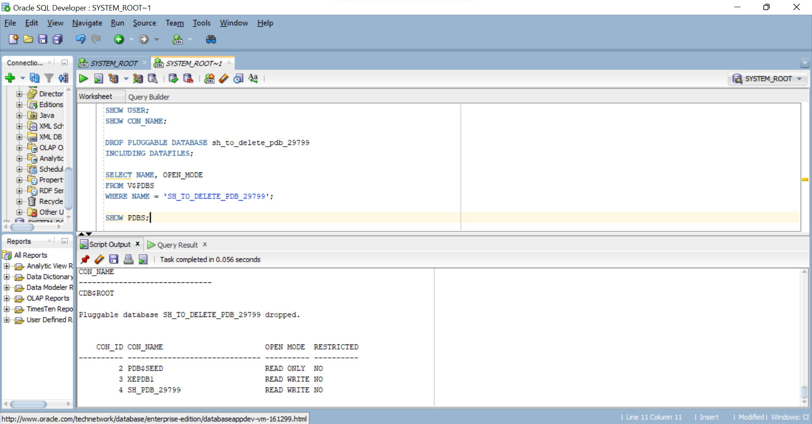
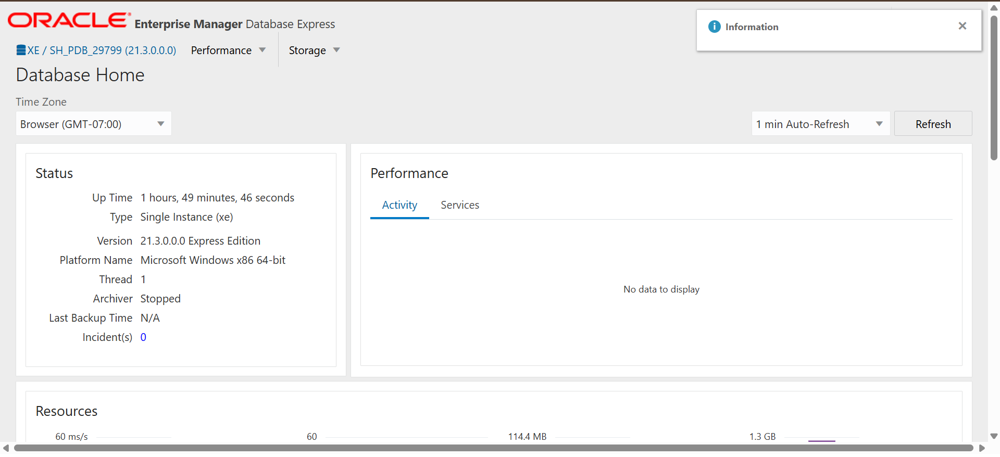

# Oracle PDB Assignment II - 29799 - Shema

## Overview

This project documents the Oracle Pluggable Database (PDB) practical assignment completed using Oracle Database 21c XE and Oracle SQL Developer.

The assignment demonstrates:
- Creation of a permanent Pluggable Database (PDB)
- Creation and verification of a database user inside the PDB
- Creation and complete deletion of a temporary PDB
- Verification of the Oracle environment using Oracle Enterprise Manager Express (OEM)

## Oracle Environment

- Database: Oracle Database 21c XE
- Tool: Oracle SQL Developer
- Operating System: Windows
- Student Name: Shema
- Student ID: 29799

---

# Task 1: Create a New PDB

A new permanent PDB was created using the required naming convention.

### PDB Name

`sh_pdb_29799`

### User Created

`shema_plsqlauca_29799`

The PDB was opened successfully in READ WRITE mode.

The required user was created inside the PDB and granted CREATE SESSION privilege.

### Evidence



---

# Task 2: Create and Delete a Temporary PDB

A temporary PDB was created using the required naming convention.

### Temporary PDB Name

`sh_to_delete_pdb_29799`

The PDB was successfully created and verified in the Oracle container database.

After verification, the temporary PDB was completely removed using the INCLUDING DATAFILES option.

The final verification confirmed that the temporary PDB no longer existed.

### Evidence - PDB Creation



### Evidence - PDB Deletion



---

# Task 3: Oracle Enterprise Manager

Oracle Enterprise Manager Express was used to view the Oracle database environment and verify the database configuration.

The OEM dashboard provides an overview of the Oracle environment and the configured PDBs.

### Evidence



---

# Challenges and Solutions

### Challenge 1: Working with the correct PDB container

The Oracle environment contains multiple PDBs. The correct container was selected using `ALTER SESSION SET CONTAINER`.

**Solution:** The current container was verified using:

```sql
SHOW CON_NAME;
DROP PLUGGABLE DATABASE sh_to_delete_pdb_29799 INCLUDING DATAFILES;
